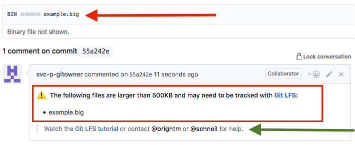

## Watchdog4Git

Watchdog4Git is a bot 🤖 that checks commits pushed to GitHub for common Git problems. If the bot identifies a problem, then it notifies the committer by posting a comment to the commit.

Currently Watchdog4Git checks only for [Git LFS](https://git-lfs.github.com/) related problems:
- The watchdog warns if large files are added to the repository that should be tracked by Git LFS.
- The watchdog warns if files that are defined as Git LFS files are not committed as Git LFS files (likely because of an invalid local Git LFS setup).



In the future Watchdog4Git could also check for [Git Submodule](https://git-scm.com/book/en/v2/Git-Tools-Submodules) problems, [`.gitignore`](https://git-scm.com/docs/gitignore) problems, and other Git related problems.

### Getting started

1. Build Watchdog4Git:
```
make deps
make
```
3. Deploy the `watchdog4git` executable to your [webhook server](https://help.github.com/articles/about-webhooks/). 
2. Define the `GITHUB_TOKEN` environment variable with a [GitHub token](https://help.github.com/articles/creating-a-personal-access-token-for-the-command-line/) that has read access permissions to your repositories.
3. Run Watchdog4Git on the server.
4. Add a webhook to your repository or organization and point it to your server. Choose `application/json` as the request type and choose only the `push` event.
5. Add a `.github/watchdog.yml` file to your repository that configures the Git LFS checks:

```
# Contact for users in notification comments (can include GitHub @mentions)
helpContact: "[#your-channel](https://yourcompany.slack.com/messages/ABC1234)"

# General size threshold for files that should be in Git LFS
# (uncompressed size in bytes)
lfsSizeThreshold: 512000

# List of files that except from the general size threshold
# (typically large text files, optional)
lfsSizeExemptions: |
    testdata/largetext.txt
    *.xml
    
# Size threshold for exempt files that should be in Git LFS
# (uncompressed size in bytes, optional)
lfsSizeExemptionsThreshold: 20000000

# Switch to turn on/off Git LFS file size suggestions
lfsSuggestionsEnabled: Yes
```

In the future we plan to release Watchdog4Git as [GitHub App](https://github.com/marketplace) to ease the setup. 

### How does it work?

Watchdog4Git receives GitHub [webhook](https://developer.github.com/webhooks/) events for every push. The payload contains a list of commits whose metadata contain the list of added, modified, and deleted files.

Before examining the pushed commits, Watch4Dog downloads and parses the `.gitattributes` file from the default branch to learn what files are currently tracked by Git LFS. For each added or modified file in each commit, the bot [queries the file size](https://developer.github.com/v3/repos/contents/) and checks:
- If the file matches the Git LFS path pattern but has no valid Git LFS pointer content, then the file is marked as *misconfiguration*.
- If the file does not match a Git LFS path pattern but is greater than the defined threshold, then the file is marked as *suggestion*.
Finally, all misconfigurations and suggestions are rolled up in a single commit comment.

### Contributors

These are the humans that develop Watchdog4Git:

| [](https://github.com/larsxschneider)<br><sub>[@larsxschneider](https://github.com/larsxschneider)</sub> | [](https://github.com/mlbright)<br><sub>[@mlbright](https://github.com/mlbright)</sub> |
|---|---|

## License

SPDX-License-Identifier: [MIT](LICENSE.md)

